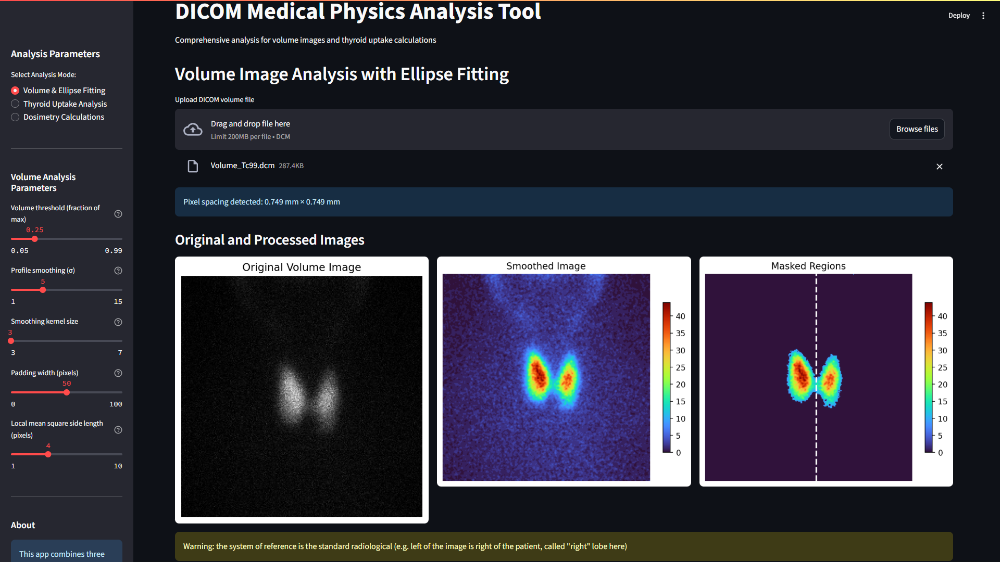
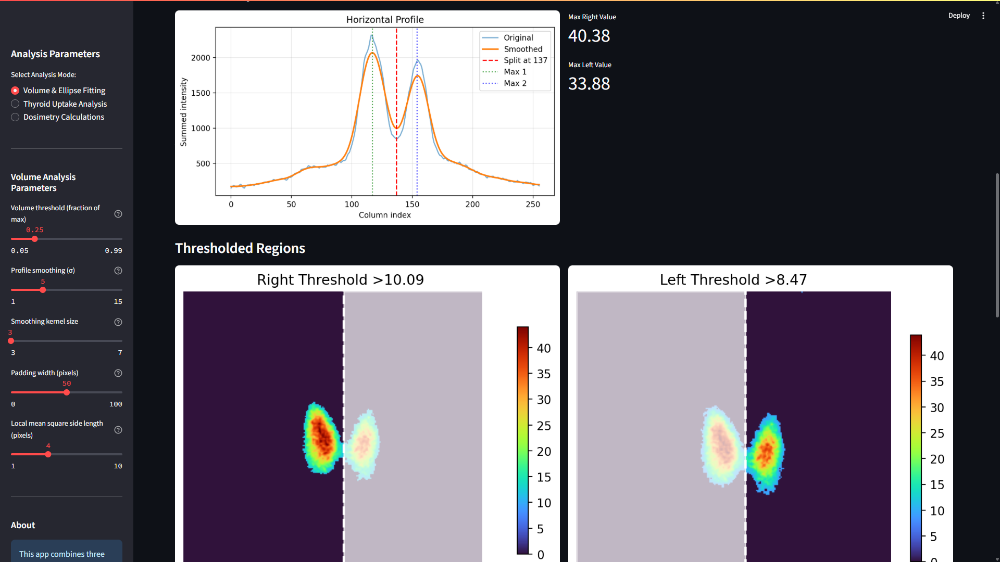
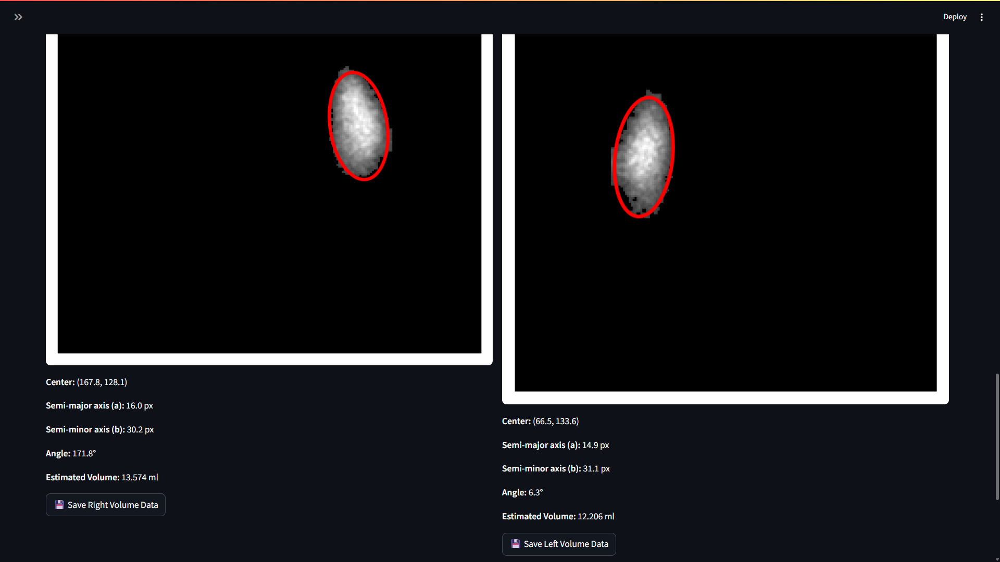
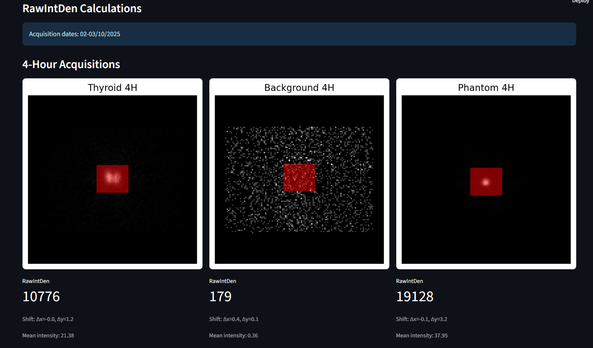
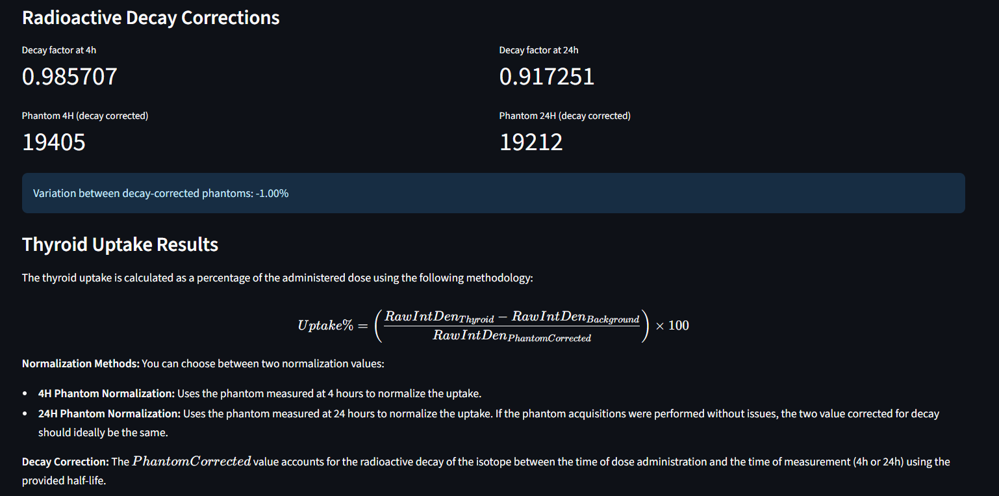
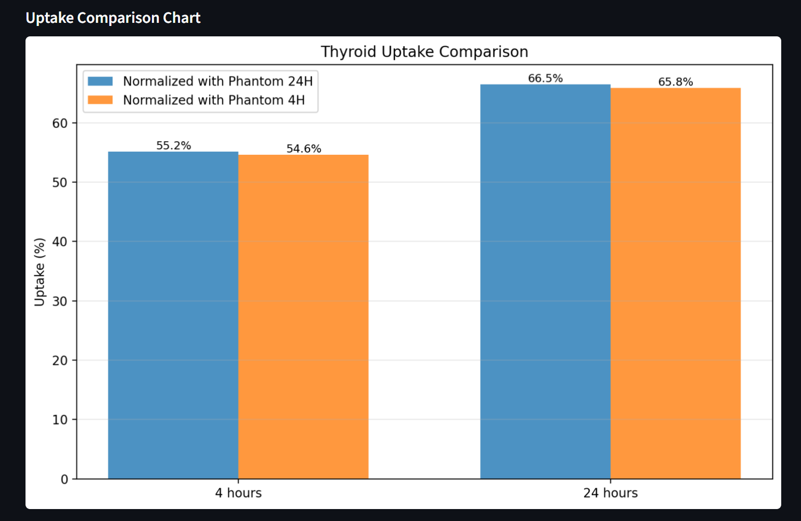
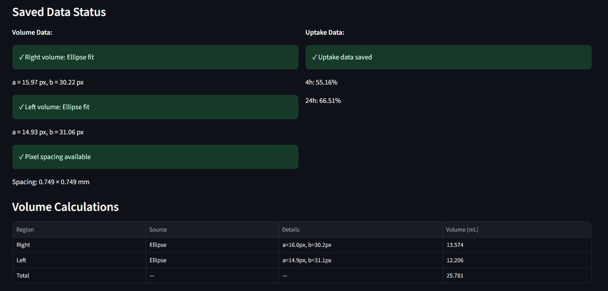
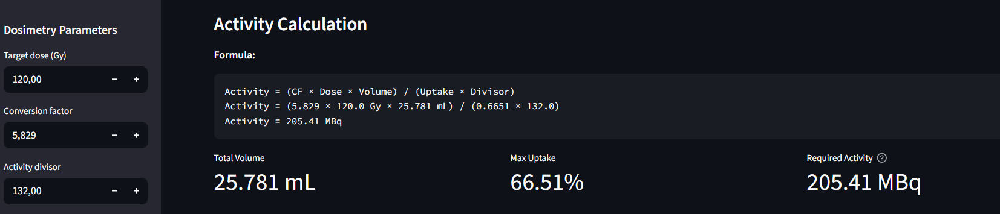
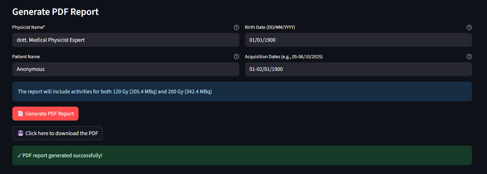
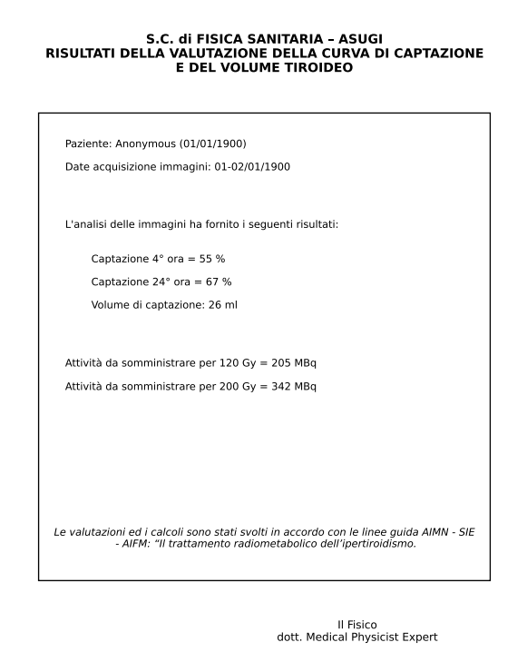

# Thyroid I-131 Dosimetry Tool

Open-source Python application for **automated thyroid dosimetry analysis** in hyperthyroidism radiometabolic therapy.

This software provides a **local web-based graphical user interface (GUI)** that automates the workflow from **raw DICOM scintigraphy images to patient-specific activity calculation** for I-131 therapy.

It implements the traditional manual workflow used in nuclear medicine departments and converts it into a **reproducible, transparent, and semi-automated pipeline**.


## Overview

Patient-specific dosimetry is a fundamental requirement in modern radiometabolic therapy. According to the **Council Directive 2013/59/EURATOM**, radiotherapeutic exposures must be individually planned to optimize dose delivery to the target while minimizing exposure to non-target tissues.

In the case of **I-131 therapy for hyperthyroidism**, determining the therapeutic activity requires:

* Estimation of **functional thyroid volume**
* Measurement of **thyroid iodine uptake**
* Application of the **Marinelli–Quimby equation**

Traditionally, these steps are performed manually using image analysis tools such as ImageJ, requiring multiple manual measurements and calculations. This workflow is:

* Time-consuming
* Operator-dependent
* Susceptible to inter-observer variability

This project provides a **fully integrated tool that standardizes the analysis process**, improving reproducibility and reducing manual errors.

---

## Key Features

* Automated **thyroid volume estimation**
* Automated **ROI-based uptake calculation**
* Decay correction using isotope half-life
* **Patient-specific therapeutic activity calculation**
* Interactive **GUI for parameter tuning**
* Direct **patient-specific DICOM metadata extraction**
* Automated **clinical PDF report generation**
* Fully **open-source and customizable**

---

## Software Architecture

The application is written in **Python** and uses the following libraries:

| Library       | Purpose                                 |
| ------------- | --------------------------------------- |
| Streamlit     | Web-based GUI                           |
| OpenCV        | Image segmentation and ellipse fitting  |
| NumPy / SciPy | Numerical and signal processing         |
| PyDICOM       | DICOM image and metadata handling       |
| Matplotlib    | Visualization and PDF report generation |

The application runs **locally in a browser**, meaning:

* No external server required
* Patient data remains **locally stored** and are not sent across the internet
* Easy deployment inside hospital networks

---

# Workflow

The application follows a **three-stage workflow** that mirrors the traditional manual dosimetric procedure used in nuclear medicine departments.

---

# 1. Thyroid Volume Analysis

Functional thyroid volume is estimated from **planar scintigraphy images**.

The workflow implemented in the software replicates the procedure typically performed manually during scintigraphic analysis.

### Algorithm

1. Import DICOM planar scintigraphy image
2. Apply smoothing filter to reduce noise
3. Compute horizontal intensity profile
4. Identify the two thyroid lobes using peak detection
5. Apply **threshold segmentation**
6. Fit an ellipse to each lobe
7. Estimate lobe volume assuming an ellipsoid geometry

The thyroid lobe volume is estimated using:


$$V = \frac{4}{3} \pi a^2 b$$


where:

* (a) = major semi-axis
* (b) = minor semi-axis

The total thyroid volume is the sum of the two lobes.

The software allows for manual volume override, useful for challenging cases where elliptic fitting fails, or for accomodating clinical indications requiring single-lobe consideration





---

# 2. Thyroid Uptake Calculation

The software calculates **thyroid uptake at 4 hours and 24 hours** after tracer administration.

### Required Images

For each time point:

* Thyroid image
* Background image (thigh)
* Reference phantom image

### Uptake Formula

The uptake is calculated as:


$$ U(t) = \frac{C_{thyroid}(t) - C_{background}(t)}{C_{phantom}(t=administration time)} \times 100 $$

where:

* $C_{thyroid}$ : counts in thyroid ROI
* $C_{background}$ : counts in background ROI
* $C_{phantom}$ : counts measured in reference phantom

The phantom counts are **corrected for radioactive decay**.

### MIRD Formalism

The dosimetric approach implemented in this software is based on the **MIRD formalism** (Medical Internal Radiation Dose).

Mean absorbed dose is described by:


$$ D = \tilde{A} \cdot S $$


where:

* $\tilde{A}$ : cumulated activity in source region
* $S$ : radionuclide-specific S-factor

In hyperthyroidism therapy, the thyroid acts as both **source and target organ**, simplifying the dosimetric model.






---

# 3. Dosimetry Calculation

The therapeutic activity is calculated using the **Marinelli-Quimby equation**.


$$ A = 5.829 \cdot \frac{D_T \cdot m}{U_{max} \cdot T_{1/2}^{eff}} $$

Where:

| Parameter       | Meaning                         |
| --------------- | ------------------------------- |
| $A$             | Activity to administer (MBq)    |
| $D_T$           | Prescribed dose to thyroid (Gy) |
| $m$             | Thyroid mass (g)                |
| $U_{max}$       | Maximum iodine uptake           |
| $T_{1/2}^{eff}$ | Effective half-life             |




---

# Clinical Report Generation

The software automatically generates a **standardized PDF report** containing:

* Patient information extracted from DICOM
* Uptake values
* Thyroid volume
* Prescribed dose
* Calculated activity
  
Note that the text in the PDF report has been personalized for the ASUGI hospital at Trieste, Italy, but can be easily customized in the source code by end-users for different hospitals.




---

# Installation

### Requirements

Python ≥ 3.9

Install dependencies:

```bash
pip install streamlit numpy scipy matplotlib pydicom opencv-python
```

---

# Running the Application

Launch the application with:

```bash
streamlit run app.py
```

The GUI will open in your browser.

---

# Example Workflow

1. Launch the application
2. Select **Volume & Ellipse Fitting**
3. Upload thyroid scintigraphy DICOM
4. Save lobe volumes
5. Switch to **Uptake Analysis**
6. Upload reference, thyroid, background, and phantom images
7. Save uptake results
8. Switch to **Dosimetry Calculations**
9. Enter prescribed dose
10. Generate therapeutic activity and PDF report

---

# Future Improvements

Potential extensions include:

* Automated effective half-life estimation.
* PDF customization options directly inside GUI.
* Additional customizable parameters.
* Improved segmentation using neural networks.

---

# Credits

Alessandro Michele Ferrara - Department of Physics and Astronomy "Galileo Galilei", University of Padua, Padua - Department of Medical Physics, Azienda Sanitaria Universitaria Giuliano Isontina (ASUGI), Trieste

Sara Savatović - Department of Physics and Astronomy "Galileo Galilei", University of Padua, Padua - Department of Medical Physics, Azienda Sanitaria Universitaria Giuliano Isontina (ASUGI), Trieste 

---


# Disclaimer

Clinical decisions must always be verified by qualified medical physicist experts and medical professionals.


